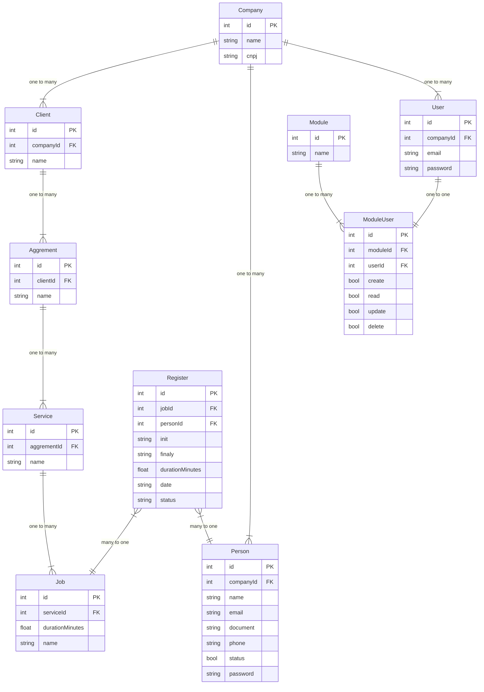

```mermaid
erDiagram
    Company {
        int id PK
        string name
        string cnpj
    }
    Client {
        int id PK
        int companyId FK
        string name
    }
    Aggrement {
        int id PK
        int clientId FK
        string name
    }
    Service {
        int id PK
        int aggrementId FK
        string name
    }
    Job {
        int id PK
        int serviceId FK
        float durationMinutes
        string name
    }
    Person {
        int id PK
        int companyId FK
        string name
        string email
        string document
        string phone
        bool status
        string password
    }

    User {
        int id PK
        int companyId FK
        string email
        string password
    }

    Module {
        int id PK
        string name
    }

    ModuleUser {
        int id PK
        int moduleId FK
        int userId FK
        bool create
        bool read
        bool update
        bool delete
    }

    Register {
        int id PK
        int jobId FK
        int personId FK
        string init
        string finaly
        float durationMinutes
        string date
        string status
    }

    Company      ||--|{ Client : "one to many"
    Company      ||--|{ Person : "one to many"
    Company      ||--|{ User : "one to many"
    Client       ||--|{ Aggrement : "one to many"
    Aggrement    ||--|{ Service : "one to many"
    Service      ||--|{ Job : "one to many"
    Register     }|--|| Job : "many to one"
    Register     }|--|| Person : "many to one"
    User         ||--|| ModuleUser : "one to one"
    Module       ||--|{ ModuleUser : "one to many"

```